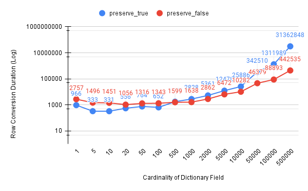

## Benchmarking Row conversion on low and high cardinality dicts W/ dict preserving

### Setting Up

```bash
git clone https://github.com/JayjeetAtGithub/arrow-rs
cd arrow-rs
git checkout sort-fix-bench
cargo bench --bench row_format "row_conv_" 
```

### With `RowConverter`

```bash
convert_columns row_conv_low_card_preserve
                        time:   [73.370 µs 73.732 µs 74.108 µs]
                        change: [-1.7656% -1.1403% -0.4752%] (p = 0.00 < 0.05)
                        Change within noise threshold.

convert_columns row_conv_low_card_no_preserve
                        time:   [92.476 µs 93.458 µs 94.522 µs]
                        change: [-0.2377% +1.4107% +2.9991%] (p = 0.09 > 0.05)
                        No change in performance detected.

Benchmarking convert_columns row_conv_high_card_preserve: Warming up for 3.0000 s
Warning: Unable to complete 100 samples in 5.0s. You may wish to increase target time to 8.5s, enable flat sampling, or reduce sample count to 50.
convert_columns row_conv_high_card_preserve
                        time:   [1.6851 ms 1.6975 ms 1.7110 ms]
                        change: [+487.28% +492.25% +497.06%] (p = 0.00 < 0.05)
                        Performance has regressed.
Found 25 outliers among 100 measurements (25.00%)
  7 (7.00%) low mild
  9 (9.00%) high mild
  9 (9.00%) high severe

convert_columns row_conv_high_card_no_preserve
                        time:   [296.64 µs 299.24 µs 301.77 µs]
                        change: [+2.8411% +4.0966% +5.3572%] (p = 0.00 < 0.05)
                        Performance has regressed.
Found 7 outliers among 100 measurements (7.00%)
  4 (4.00%) low mild
  3 (3.00%) high mild
```

### With `CardinalityAwareRowConverter`

```bash
convert_columns row_conv_low_card_preserve
                        time:   [74.071 µs 74.486 µs 74.926 µs]
                        change: [-0.4088% +0.3845% +1.1697%] (p = 0.34 > 0.05)
                        No change in performance detected.

convert_columns row_conv_low_card_no_preserve
                        time:   [90.552 µs 91.586 µs 92.734 µs]
                        change: [-8.1676% -6.8138% -5.3945%] (p = 0.00 < 0.05)
                        Performance has improved.
Found 5 outliers among 100 measurements (5.00%)
  5 (5.00%) high mild

convert_columns row_conv_high_card_preserve
                        time:   [286.31 µs 289.20 µs 292.14 µs]
                        change: [-3.2403% -1.5943% +0.1647%] (p = 0.07 > 0.05)
                        No change in performance detected.
Found 3 outliers among 100 measurements (3.00%)
  2 (2.00%) high mild
  1 (1.00%) high severe

convert_columns row_conv_high_card_no_preserve
                        time:   [288.37 µs 291.10 µs 293.34 µs]
                        change: [-3.2997% -2.0959% -0.9263%] (p = 0.00 < 0.05)
                        Change within noise threshold.
Found 20 outliers among 100 measurements (20.00%)
  15 (15.00%) low severe
  1 (1.00%) low mild
  2 (2.00%) high mild
  2 (2.00%) high severe
```

**Observation:** For low cardinality, preserving dict is beneficial, but for high cardinality, preserving is highly damaging. Also, no regression is observed while moving from `RowConverter` to `CardinalityAwareRowConverter`.


## Determing the value of `LOW_CARDINALITY_THRESHOLD`

To determine the most appropriate value of the low cardinality threshold, we designed an experiment where we used the `RowConverter` to convert batches having sort fields with cardinalities ranging from `1` to `500000`. We repeated the experiment twice, turning the dictionary preserving on and off. We used a randomly generated record batch with `1000` rows and a schema  `a: dict<int32,utf8>, b: int32`. The code for the experiment can be found [here](https://github.com/JayjeetAtGithub/arrow-datafusion/commit/b05919fb0b8da95b956d4270fe33b3ec921dc6ed). The result from this experiment is shown in the plot below and the absolute numbers can be found [here](https://docs.google.com/spreadsheets/d/1ELfJaLx_VydYS_K2CSkvs1dbn2FaenpYpXxiSHjvI8M/edit?usp=sharing). 



**Observation:** As evident from the plot, we see that dictionary preservation keeps benefiting the row conversion till a cardinality of `~500` (for the sort fields), where the performance with and without dictionary preservation coincides. After `500`, dictionary preservation becomes damaging quickly. Hence, we decide to use `512` as our threshold for low cardinality.
